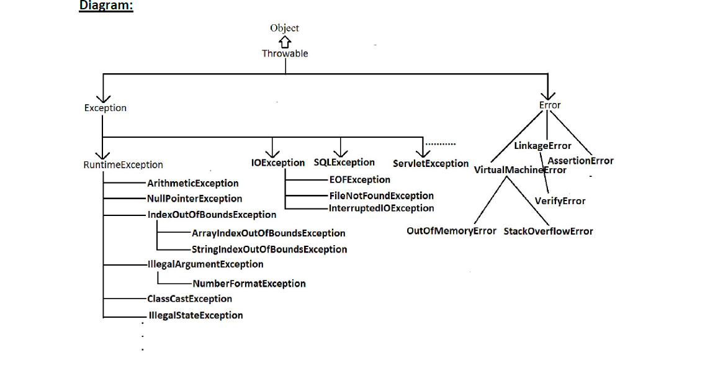

Yes, that's correct. SecurityException in Java is an unchecked exception, which means:
It inherits from RuntimeException.
You are not required to handle it explicitly with a try-catch block or declare it in the throws clause of a method.
It typically indicates a security violation, such as accessing a restricted resource or performing a prohibited operation.