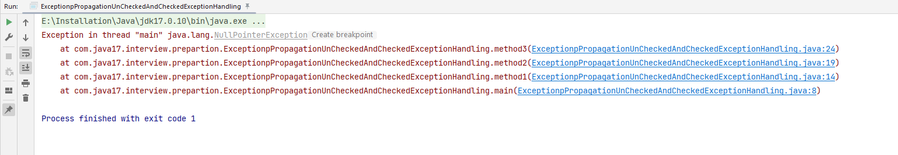

Exception Propagation 

Whenever methods are called stack is formed and an exception is first thrown from the top of the stack and if it is not caught, it starts coming down the stack to previous methods until it is not caught.
If exception remains uncaught even after reaching bottom of the stack it is propagated to JVM and program is terminated.

Now, i’ll be explaining you how unchecked exception was propagated.
Let’s see step by step what happened in above program >

JVM called main method

step 1 - main called method1()

step 2 - method1 called method2()

step 3 - method2 called method3()

step 4 - method3 automatically propagated exception to method2() [because, unchecked exceptions are propagated automatically]

step 5 - method2 automatically propagated exception to method1() [because, unchecked exceptions are propagated automatically]

step 6 - method2 automatically propagated exception to main() [because, unchecked exceptions are propagated automatically]

main() automatically propagated exception to JVM [because, unchecked exceptions are propagated automatically]

In the above program, stack is formed and an exception is first thrown from the top of the stack [ method3() ] and it remains uncaught there, and starts coming down the stack to previous methods to method2(), then to method1(), than to main() and it remains uncaught throughout.
exception remains uncaught even after reaching bottom of the stack [ main() ] so it is propagated to JVM and ultimately program is terminated by throwing exception 
