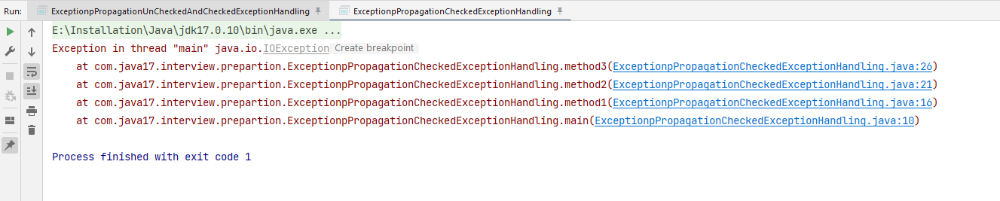

Now, i’ll be explaining you how checked exception was propagated.
Let’s see step by step what happened in above program >

JVM called main method

step 1 - main called method1()

step 2 - method1 called method2()

step 3 - method2 called method3()

step 4 - method3 propagated exception to method2() using throws keyword.[because, checked exceptions are not propagated automatically]

step 5 - method2 propagated exception to method1() using throws keyword.[because, checked exceptions are not propagated automatically]

step 6 - method2 propagated exception to main() using throws keyword.[because, checked exceptions are not propagated automatically]

main() propagated exception to JVM using throws keyword.[because, checked exceptions are not propagated automatically]

